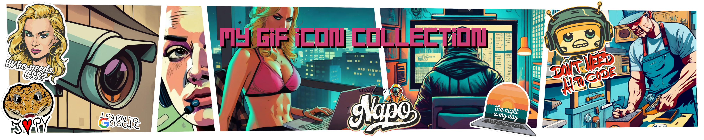
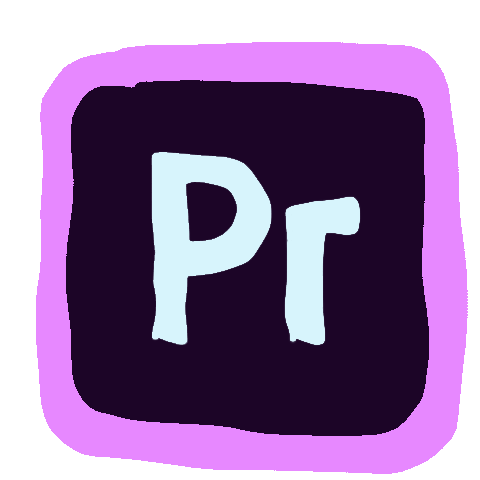
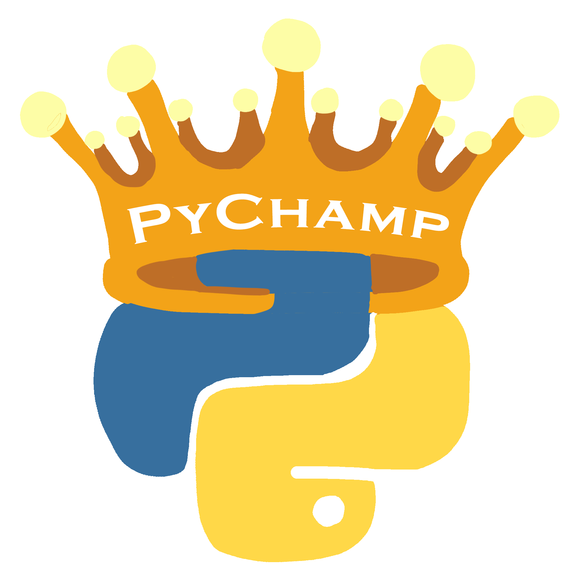
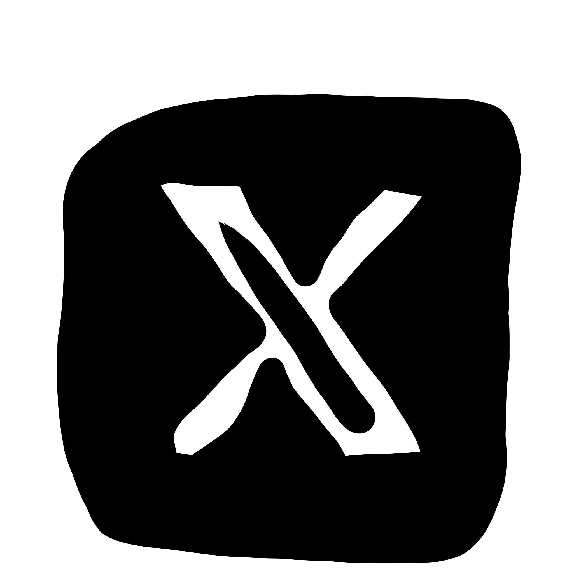
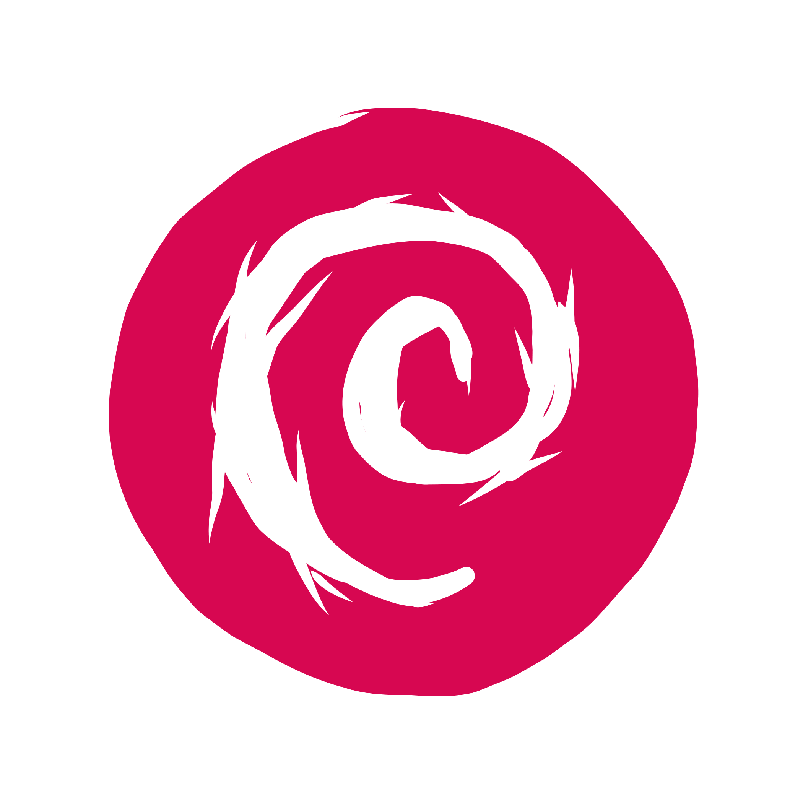
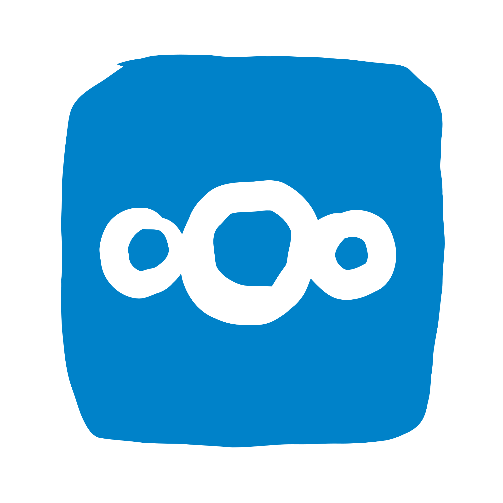

      

- [adobe](#adobe)
  - [adobe_ae.gif](adobe_adobe_ae)
  - [adobe_fr.gif](adobe_adobe_fr)
  - [adobe_pr.gif](adobe_adobe_pr)
  - [adobe_ps.gif](adobe_adobe_ps)
- [code](#code)
  - [code_css.gif](code_code_css)
  - [code_html.gif](code_code_html)
  - [code_java.gif](code_code_java)
  - [code_lua.gif](code_code_lua)
  - [code_python.gif](code_code_python)
- [fake](#fake)
  - [fake_maus.gif](fake_fake_maus)
- [mylogo](#mylogo)
  - [mylogo_CC.gif](mylogo_mylogo_cc)
  - [mylogo_PyChamp.gif](mylogo_mylogo_pychamp)
- [piktogramm](#piktogramm)
  - [piktogramm_attention.gif](piktogramm_piktogramm_attention)
  - [piktogramm_bell.gif](piktogramm_piktogramm_bell)
  - [piktogramm_change.gif](piktogramm_piktogramm_change)
  - [piktogramm_controle.gif](piktogramm_piktogramm_controle)
  - [piktogramm_i.gif](piktogramm_piktogramm_i)
  - [piktogramm_meeting.gif](piktogramm_piktogramm_meeting)
  - [piktogramm_placeholder.gif](piktogramm_piktogramm_placeholder)
  - [piktogramm_read.gif](piktogramm_piktogramm_read)
  - [piktogramm_server.gif](piktogramm_piktogramm_server)
  - [piktogramm_text_talk.gif](piktogramm_piktogramm_text_talk)
  - [piktogramm_under_construction.gif](piktogramm_piktogramm_under_construction)
  - [piktogramm_update.gif](piktogramm_piktogramm_update)
- [platfrom](#platfrom)
  - [platfrom_discord.gif](platfrom_platfrom_discord)
  - [platfrom_discord_bot.gif](platfrom_platfrom_discord_bot)
  - [platfrom_facebook.gif](platfrom_platfrom_facebook)
  - [platfrom_git.gif](platfrom_platfrom_git)
  - [platfrom_github.gif](platfrom_platfrom_github)
  - [platfrom_instagram.gif](platfrom_platfrom_instagram)
  - [platfrom_nfttabelst.gif](platfrom_platfrom_nfttabelst)
  - [platfrom_reddit.gif](platfrom_platfrom_reddit)
  - [platfrom_twitch.gif](platfrom_platfrom_twitch)
  - [platfrom_x.gif](platfrom_platfrom_x)
  - [platfrom_youtobe.gif](platfrom_platfrom_youtobe)
- [programm](#programm)
  - [programm_aud.gif](programm_programm_aud)
  - [programm_debian.gif](programm_programm_debian)
  - [programm_filezilla.gif](programm_programm_filezilla)
  - [programm_gitea.gif](programm_programm_gitea)
  - [programm_nextcloud.gif](programm_programm_nextcloud)
  - [programm_nginx.gif](programm_programm_nginx)
  - [programm_paint.gif](programm_programm_paint)
  - [programm_vsc.gif](programm_programm_vsc)
- [promo](#promo)
  - [promo_buy_me_a_cofe.gif](promo_promo_buy_me_a_cofe)
  - [promo_kofi.gif](promo_promo_kofi)

<h2 id='adobe'>adobe</h2>

 [adobe_ae.gif](My_gif_Icon_collection/adobe_ae.gif)

 [adobe_fr.gif](My_gif_Icon_collection/adobe_fr.gif)

 [adobe_pr.gif](My_gif_Icon_collection/adobe_pr.gif)

 [adobe_ps.gif](My_gif_Icon_collection/adobe_ps.gif)

<h2 id='code'>code</h2>

 [code_css.gif](My_gif_Icon_collection/code_css.gif)

 [code_html.gif](My_gif_Icon_collection/code_html.gif)

 [code_java.gif](My_gif_Icon_collection/code_java.gif)

 [code_lua.gif](My_gif_Icon_collection/code_lua.gif)

 [code_python.gif](My_gif_Icon_collection/code_python.gif)

<h2 id='fake'>fake</h2>

 [fake_maus.gif](My_gif_Icon_collection/fake_maus.gif)

<h2 id='mylogo'>mylogo</h2>

 [mylogo_CC.gif](My_gif_Icon_collection/mylogo_CC.gif)

 [mylogo_PyChamp.gif](My_gif_Icon_collection/mylogo_PyChamp.gif)

<h2 id='piktogramm'>piktogramm</h2>

 [piktogramm_attention.gif](My_gif_Icon_collection/piktogramm_attention.gif)

 [piktogramm_bell.gif](My_gif_Icon_collection/piktogramm_bell.gif)

 [piktogramm_change.gif](My_gif_Icon_collection/piktogramm_change.gif)

 [piktogramm_controle.gif](My_gif_Icon_collection/piktogramm_controle.gif)

 [piktogramm_i.gif](My_gif_Icon_collection/piktogramm_i.gif)

 [piktogramm_meeting.gif](My_gif_Icon_collection/piktogramm_meeting.gif)

 [piktogramm_placeholder.gif](My_gif_Icon_collection/piktogramm_placeholder.gif)

 [piktogramm_read.gif](My_gif_Icon_collection/piktogramm_read.gif)

 [piktogramm_server.gif](My_gif_Icon_collection/piktogramm_server.gif)

 [piktogramm_text_talk.gif](My_gif_Icon_collection/piktogramm_text_talk.gif)

 [piktogramm_under_construction.gif](My_gif_Icon_collection/piktogramm_under_construction.gif)

 [piktogramm_update.gif](My_gif_Icon_collection/piktogramm_update.gif)

<h2 id='platfrom'>platfrom</h2>

 [platfrom_discord.gif](My_gif_Icon_collection/platfrom_discord.gif)

 [platfrom_discord_bot.gif](My_gif_Icon_collection/platfrom_discord_bot.gif)

 [platfrom_facebook.gif](My_gif_Icon_collection/platfrom_facebook.gif)

 [platfrom_git.gif](My_gif_Icon_collection/platfrom_git.gif)

 [platfrom_github.gif](My_gif_Icon_collection/platfrom_github.gif)

 [platfrom_instagram.gif](My_gif_Icon_collection/platfrom_instagram.gif)

 [platfrom_nfttabelst.gif](My_gif_Icon_collection/platfrom_nfttabelst.gif)

 [platfrom_reddit.gif](My_gif_Icon_collection/platfrom_reddit.gif)

 [platfrom_twitch.gif](My_gif_Icon_collection/platfrom_twitch.gif)

 [platfrom_x.gif](My_gif_Icon_collection/platfrom_x.gif)

 [platfrom_youtobe.gif](My_gif_Icon_collection/platfrom_youtobe.gif)

<h2 id='programm'>programm</h2>

 [programm_aud.gif](My_gif_Icon_collection/programm_aud.gif)

 [programm_debian.gif](My_gif_Icon_collection/programm_debian.gif)

 [programm_filezilla.gif](My_gif_Icon_collection/programm_filezilla.gif)

 [programm_gitea.gif](My_gif_Icon_collection/programm_gitea.gif)

 [programm_nextcloud.gif](My_gif_Icon_collection/programm_nextcloud.gif)

 [programm_nginx.gif](My_gif_Icon_collection/programm_nginx.gif)

 [programm_paint.gif](My_gif_Icon_collection/programm_paint.gif)

 [programm_vsc.gif](My_gif_Icon_collection/programm_vsc.gif)

<h2 id='promo'>promo</h2>

 [promo_buy_me_a_cofe.gif](My_gif_Icon_collection/promo_buy_me_a_cofe.gif)

 [promo_kofi.gif](My_gif_Icon_collection/promo_kofi.gif)

## ☕ Buy me a coffee 

Feel free to show your appreciation by treating me to a virtual coffee. Your support means a lot and keeps the creative coding vibes going! 🚀

## 📚 LICENSE 

[GNU GENERAL PUBLIC LICENSE Version 3](LICENSE)

[My_gif_Icon_collection](My_gif_Icon_collection) was created on 09.February.2024 by [NapoII](https://github.com/NapoII)

