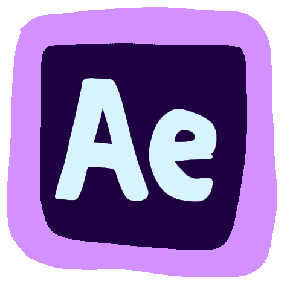
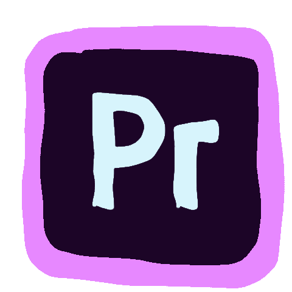
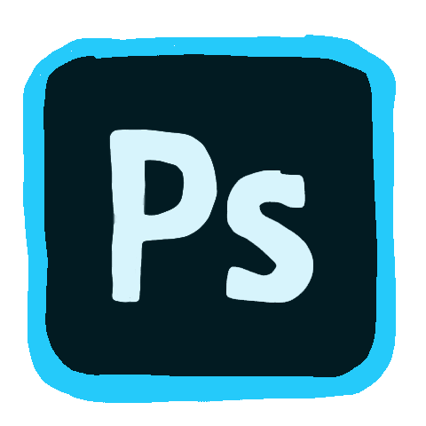
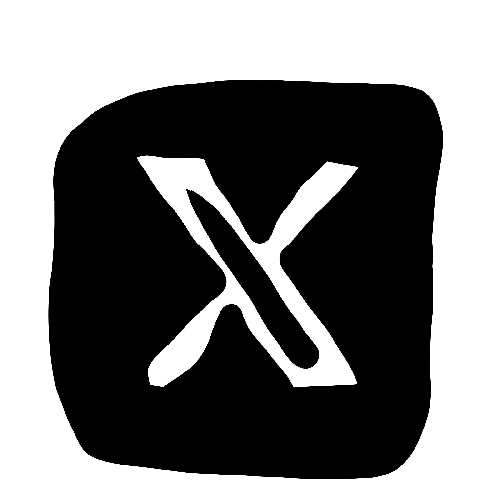
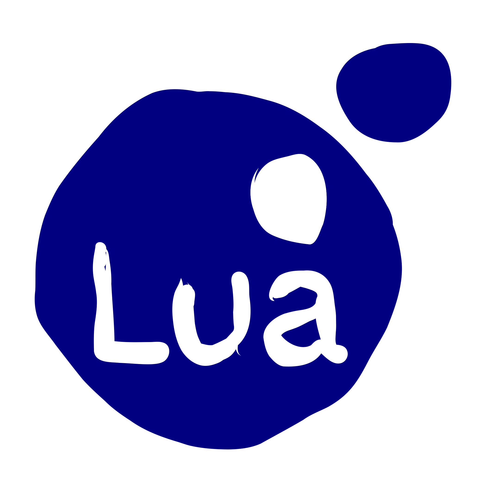
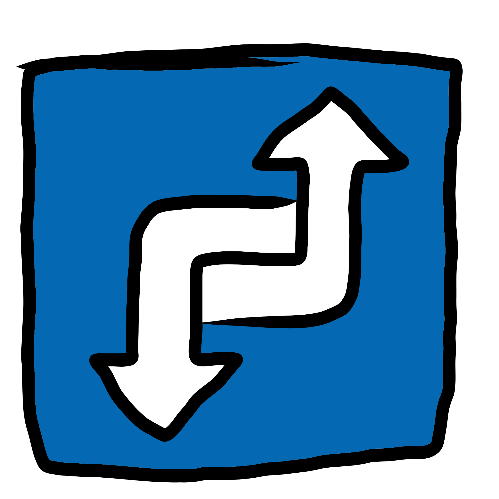
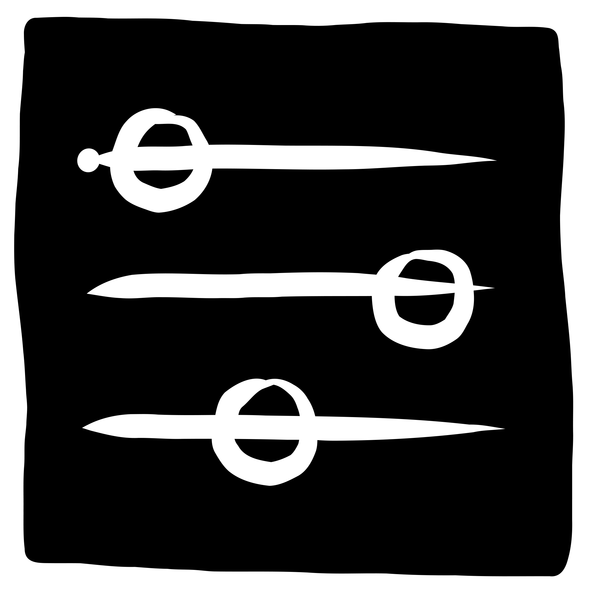
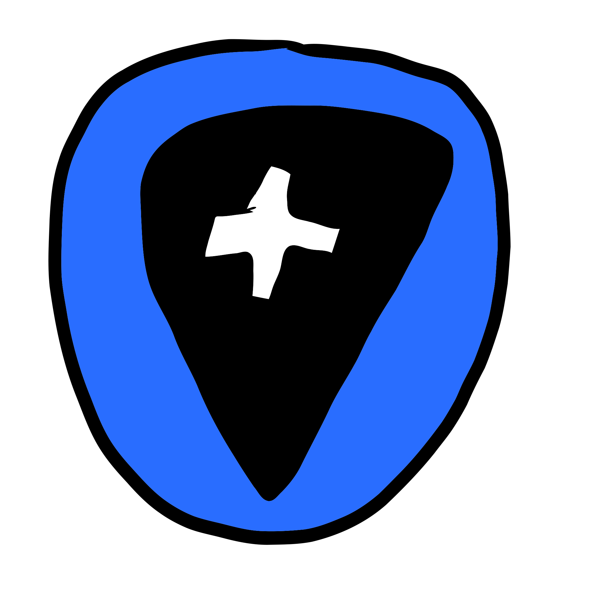
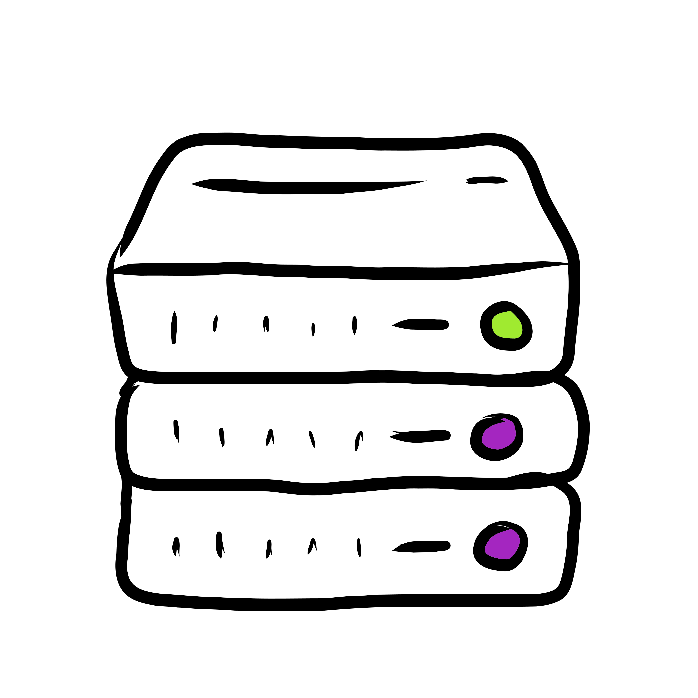
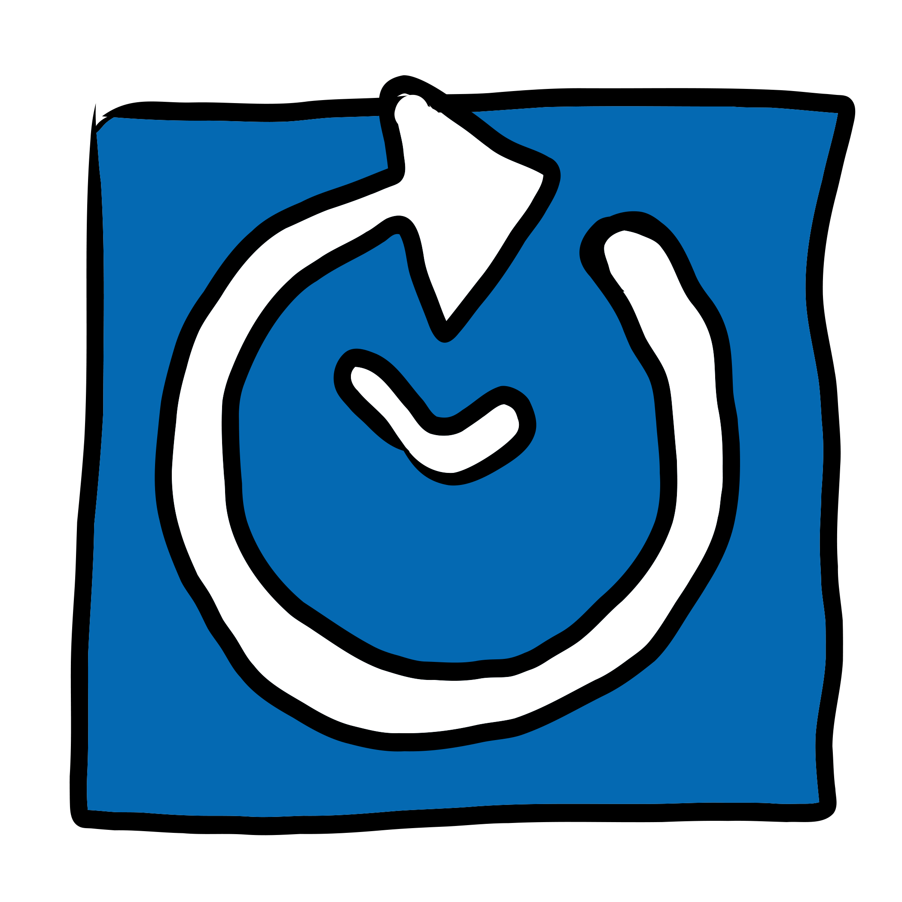

      

- [Adobe](#Adobe)
  - [Adobe_ae.gif](adobe_adobe_ae)
  - [Adobe_fr.gif](adobe_adobe_fr)
  - [Adobe_pr.gif](adobe_adobe_pr)
  - [Adobe_ps.gif](adobe_adobe_ps)
- [CC.gif](#CC.gif)
  - [CC.gif](cc.gif_cc)
- [Platfrom](#Platfrom)
  - [Platfrom_discord.gif](platfrom_platfrom_discord)
  - [Platfrom_discord_bot.gif](platfrom_platfrom_discord_bot)
  - [Platfrom_facebook.gif](platfrom_platfrom_facebook)
  - [Platfrom_git.gif](platfrom_platfrom_git)
  - [Platfrom_github.gif](platfrom_platfrom_github)
  - [Platfrom_instagram.gif](platfrom_platfrom_instagram)
  - [Platfrom_nfttabelst.gif](platfrom_platfrom_nfttabelst)
  - [Platfrom_reddit.gif](platfrom_platfrom_reddit)
  - [Platfrom_twitch.gif](platfrom_platfrom_twitch)
  - [Platfrom_x.gif](platfrom_platfrom_x)
  - [Platfrom_youtobe.gif](platfrom_platfrom_youtobe)
- [Programm](#Programm)
  - [Programm_aud.gif](programm_programm_aud)
  - [Programm_debian.gif](programm_programm_debian)
  - [Programm_filezilla.gif](programm_programm_filezilla)
  - [Programm_gitea.gif](programm_programm_gitea)
  - [Programm_nextcloud.gif](programm_programm_nextcloud)
  - [Programm_nginx.gif](programm_programm_nginx)
  - [Programm_paint.gif](programm_programm_paint)
  - [Programm_vsc.gif](programm_programm_vsc)
- [PyChamp](#PyChamp)
  - [PyChamp_gif_logo.gif](pychamp_pychamp_gif_logo)
- [code](#code)
  - [code_css.gif](code_code_css)
  - [code_html.gif](code_code_html)
  - [code_java.gif](code_code_java)
  - [code_lua.gif](code_code_lua)
  - [code_python.gif](code_code_python)
- [fake](#fake)
  - [fake_maus.gif](fake_fake_maus)
- [piktogramm](#piktogramm)
  - [piktogramm_attention.gif](piktogramm_piktogramm_attention)
  - [piktogramm_bell.gif](piktogramm_piktogramm_bell)
  - [piktogramm_change.gif](piktogramm_piktogramm_change)
  - [piktogramm_controle.gif](piktogramm_piktogramm_controle)
  - [piktogramm_i.gif](piktogramm_piktogramm_i)
  - [piktogramm_meeting.gif](piktogramm_piktogramm_meeting)
  - [piktogramm_placeholder.gif](piktogramm_piktogramm_placeholder)
  - [piktogramm_read.gif](piktogramm_piktogramm_read)
  - [piktogramm_server.gif](piktogramm_piktogramm_server)
  - [piktogramm_text_talk.gif](piktogramm_piktogramm_text_talk)
  - [piktogramm_under_construction.gif](piktogramm_piktogramm_under_construction)
  - [piktogramm_update.gif](piktogramm_piktogramm_update)
- [promo](#promo)
  - [promo_buy_me_a_cofe.gif](promo_promo_buy_me_a_cofe)
  - [promo_kofi.gif](promo_promo_kofi)

<h2 id='Adobe'>Adobe</h2>
 [Adobe_ae.gif](My_gif_Icon_collection/Adobe_ae.gif)  [Adobe_fr.gif](My_gif_Icon_collection/Adobe_fr.gif)  [Adobe_pr.gif](My_gif_Icon_collection/Adobe_pr.gif) 

 [Adobe_ps.gif](My_gif_Icon_collection/Adobe_ps.gif) 

<h2 id='CC.gif'>CC.gif</h2>
 [CC.gif](My_gif_Icon_collection/CC.gif) 

<h2 id='Platfrom'>Platfrom</h2>
 [Platfrom_discord.gif](My_gif_Icon_collection/Platfrom_discord.gif)  [Platfrom_discord_bot.gif](My_gif_Icon_collection/Platfrom_discord_bot.gif)  [Platfrom_facebook.gif](My_gif_Icon_collection/Platfrom_facebook.gif) 

 [Platfrom_git.gif](My_gif_Icon_collection/Platfrom_git.gif)  [Platfrom_github.gif](My_gif_Icon_collection/Platfrom_github.gif)  [Platfrom_instagram.gif](My_gif_Icon_collection/Platfrom_instagram.gif) 

 [Platfrom_nfttabelst.gif](My_gif_Icon_collection/Platfrom_nfttabelst.gif)  [Platfrom_reddit.gif](My_gif_Icon_collection/Platfrom_reddit.gif)  [Platfrom_twitch.gif](My_gif_Icon_collection/Platfrom_twitch.gif) 

 [Platfrom_x.gif](My_gif_Icon_collection/Platfrom_x.gif)  [Platfrom_youtobe.gif](My_gif_Icon_collection/Platfrom_youtobe.gif) 

<h2 id='Programm'>Programm</h2>
 [Programm_aud.gif](My_gif_Icon_collection/Programm_aud.gif)  [Programm_debian.gif](My_gif_Icon_collection/Programm_debian.gif)  [Programm_filezilla.gif](My_gif_Icon_collection/Programm_filezilla.gif) 

 [Programm_gitea.gif](My_gif_Icon_collection/Programm_gitea.gif)  [Programm_nextcloud.gif](My_gif_Icon_collection/Programm_nextcloud.gif)  [Programm_nginx.gif](My_gif_Icon_collection/Programm_nginx.gif) 

 [Programm_paint.gif](My_gif_Icon_collection/Programm_paint.gif)  [Programm_vsc.gif](My_gif_Icon_collection/Programm_vsc.gif) 

<h2 id='PyChamp'>PyChamp</h2>
 [PyChamp_gif_logo.gif](My_gif_Icon_collection/PyChamp_gif_logo.gif) 

<h2 id='code'>code</h2>
 [code_css.gif](My_gif_Icon_collection/code_css.gif)  [code_html.gif](My_gif_Icon_collection/code_html.gif)  [code_java.gif](My_gif_Icon_collection/code_java.gif) 

 [code_lua.gif](My_gif_Icon_collection/code_lua.gif)  [code_python.gif](My_gif_Icon_collection/code_python.gif) 

<h2 id='fake'>fake</h2>
 [fake_maus.gif](My_gif_Icon_collection/fake_maus.gif) 

<h2 id='piktogramm'>piktogramm</h2>
 [piktogramm_attention.gif](My_gif_Icon_collection/piktogramm_attention.gif)  [piktogramm_bell.gif](My_gif_Icon_collection/piktogramm_bell.gif)  [piktogramm_change.gif](My_gif_Icon_collection/piktogramm_change.gif) 

 [piktogramm_controle.gif](My_gif_Icon_collection/piktogramm_controle.gif)  [piktogramm_i.gif](My_gif_Icon_collection/piktogramm_i.gif)  [piktogramm_meeting.gif](My_gif_Icon_collection/piktogramm_meeting.gif) 

 [piktogramm_placeholder.gif](My_gif_Icon_collection/piktogramm_placeholder.gif)  [piktogramm_read.gif](My_gif_Icon_collection/piktogramm_read.gif)  [piktogramm_server.gif](My_gif_Icon_collection/piktogramm_server.gif) 

 [piktogramm_text_talk.gif](My_gif_Icon_collection/piktogramm_text_talk.gif)  [piktogramm_under_construction.gif](My_gif_Icon_collection/piktogramm_under_construction.gif)  [piktogramm_update.gif](My_gif_Icon_collection/piktogramm_update.gif) 

<h2 id='promo'>promo</h2>
 [promo_buy_me_a_cofe.gif](My_gif_Icon_collection/promo_buy_me_a_cofe.gif)  [promo_kofi.gif](My_gif_Icon_collection/promo_kofi.gif) 

## ☕ Buy me a coffee 

Feel free to show your appreciation by treating me to a virtual coffee. Your support means a lot and keeps the creative coding vibes going! 🚀

## 📚 LICENSE 

[GNU GENERAL PUBLIC LICENSE Version 3](LICENSE)

[My_gif_Icon_collection](My_gif_Icon_collection) was created on 09.February.2024 by [NapoII](https://github.com/NapoII)

    

